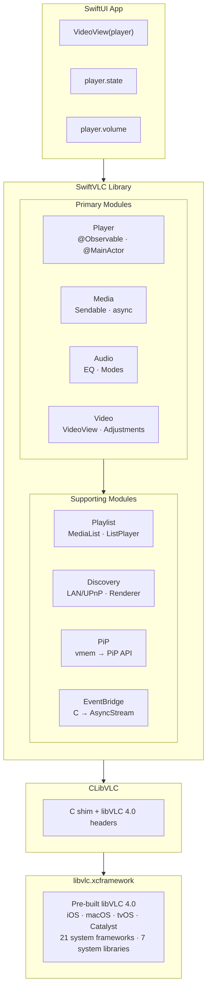
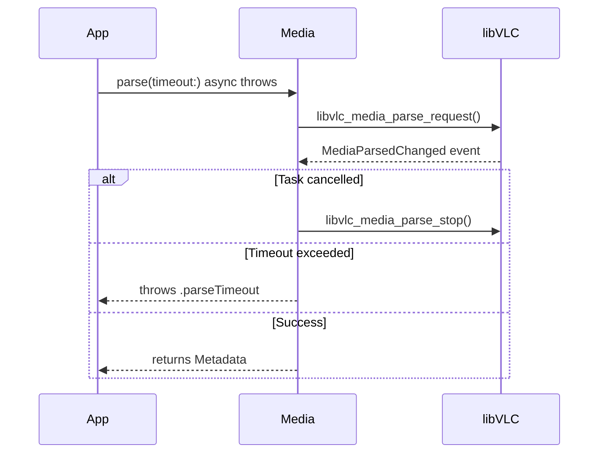
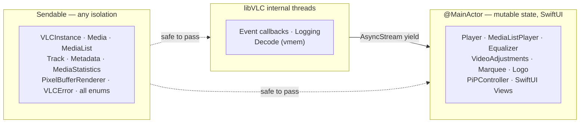
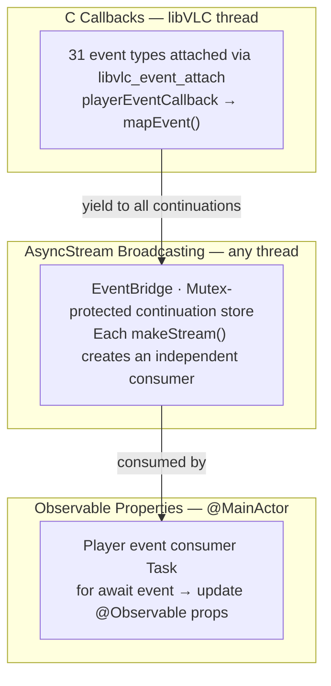
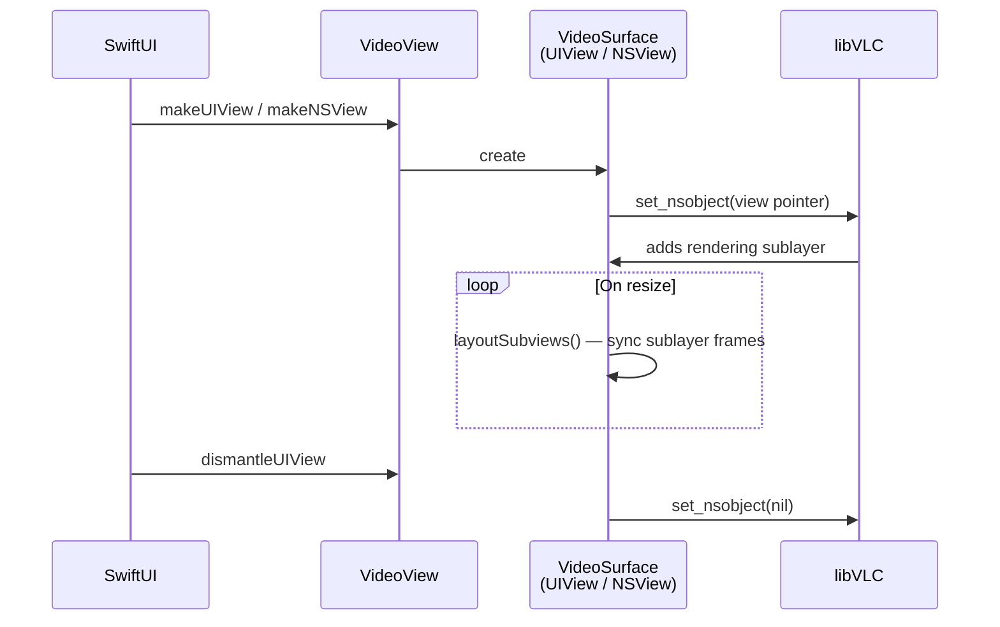
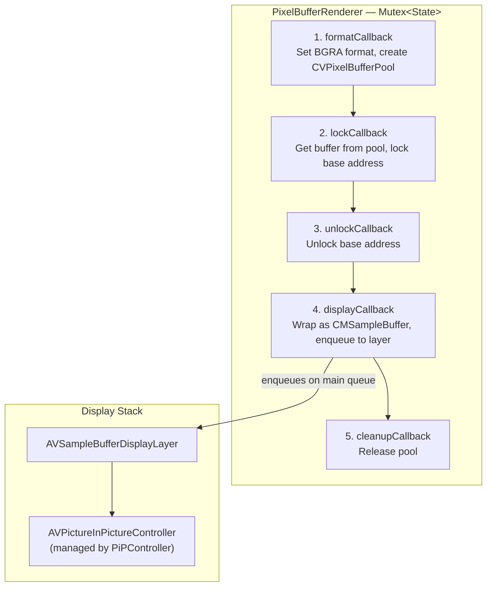
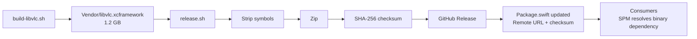

# Architecture

Technical decisions and design rationale for SwiftVLC.

## Contents

- [High-Level Overview](#high-level-overview)
- [Tech Stack](#tech-stack)
- [Module Architecture](#module-architecture)
- [C Interop Layer](#c-interop-layer)
- [Concurrency & Threading Model](#concurrency--threading-model)
- [Event System](#event-system)
- [Memory Management](#memory-management)
- [Video Rendering](#video-rendering)
- [Picture-in-Picture](#picture-in-picture)
- [Error Handling](#error-handling)
- [Testing Strategy](#testing-strategy)
- [Build & Release Infrastructure](#build--release-infrastructure)
- [Project Structure](#project-structure)

---

## High-Level Overview



**Key concepts:**

- **Swift-first**: Direct C → Swift bindings, no Objective-C intermediary (unlike VLCKit)
- **Observable state**: `@Observable` `@MainActor` Player drives SwiftUI updates automatically
- **Typed concurrency**: Swift 6 strict concurrency — all public types are `Sendable`, async APIs use `AsyncStream`
- **One-liner rendering**: `VideoView(player)` — no setup, no delegates, no callbacks
- **Typed errors**: `throws(VLCError)` for compile-time error handling

---

## Tech Stack

| Component | Choice | Why |
|---|---|---|
| **Language** | Swift 6.2+ | Strict concurrency, typed throws, `@Observable` |
| **C Bindings** | libVLC 4.0 C API | Direct access, no Objective-C overhead |
| **State** | `@Observable` / `@MainActor` | Automatic SwiftUI integration, thread safety |
| **Events** | `AsyncStream<PlayerEvent>` | Native structured concurrency, multi-consumer |
| **Video** | `UIView` / `NSView` via `set_nsobject` | Platform-native rendering, zero-copy |
| **PiP** | vmem → `CVPixelBuffer` → `AVSampleBufferDisplayLayer` | Full pixel control for PiP API |
| **Thread Safety** | `Mutex<T>`, `Sendable`, `nonisolated(unsafe)` | Compile-time data race prevention |
| **Testing** | Swift Testing framework | Modern `@Test`, `#expect`, tags, traits |
| **Platforms** | iOS 18+, macOS 15+, tvOS 18+, Mac Catalyst | Unified SwiftUI minimum |

---

## Module Architecture

### Core

Foundation types shared across all modules.

| File | Type | Purpose |
|---|---|---|
| `VLCInstance.swift` | `final class VLCInstance: Sendable` | Manages `libvlc_instance_t*` lifecycle. Singleton `shared` or custom with arguments. |
| `VLCError.swift` | `enum VLCError: Error, Sendable` | Typed errors: `instanceCreationFailed`, `mediaCreationFailed`, `playbackFailed`, `parseFailed`, `parseTimeout`, `trackNotFound`, `invalidState`, `operationFailed` |
| `Logging.swift` | `AsyncStream<LogEntry>` | Filterable log stream (debug/notice/warning/error). C shim formats `va_list` before Swift callback. |
| `Duration+Extensions.swift` | Extensions on `Duration` | `milliseconds`, `microseconds` properties and `formatted` display string |

**Default VLC arguments:** `["--no-video-title-show", "--no-stats", "--no-snapshot-preview"]`

### Player

The central observable type that drives all playback.

| File | Type | Purpose |
|---|---|---|
| `Player.swift` | `@Observable @MainActor class` | Wraps `libvlc_media_player_t*`. All playback control, state, and track management. |
| `EventBridge.swift` | `internal class` | C callbacks → `AsyncStream<PlayerEvent>` multi-consumer broadcaster |
| `PlayerState.swift` | `enum PlayerState` | `.idle`, `.opening`, `.buffering(Float)`, `.playing`, `.paused`, `.stopped`, `.stopping`, `.error` |
| `PlayerEvent.swift` | `enum PlayerEvent` | 22 event cases mapped from 31 C event types |
| `PlayerRole.swift` | `enum PlayerRole` | Audio behavior hints: `.music`, `.video`, `.communication`, `.game`, etc. |
| `ABLoop.swift` | `enum ABLoopState` | `.none` → `.pointASet` → `.active` |
| `NavigationAction.swift` | `enum NavigationAction` | DVD/Blu-ray menu: `.activate`, `.up`, `.down`, `.left`, `.right`, `.popup` |
| `Program.swift` | `struct Program` | DVB/MPEG-TS program: id, name, isSelected, isScrambled |

**Player API surface:**

```swift
// Observable properties (auto-update SwiftUI)
player.state              // PlayerState
player.currentTime        // Duration
player.duration           // Duration?
player.isSeekable         // Bool
player.isPausable         // Bool
player.currentMedia       // Media?
player.audioTracks        // [Track]
player.videoTracks        // [Track]
player.subtitleTracks     // [Track]

// Bindable properties (two-way binding)
player.position           // Double (0.0–1.0), seeks on set
player.volume             // Float (0.0–1.25)
player.isMuted            // Bool
player.rate               // Float (0.25–4.0)
player.selectedAudioTrack // Track?
player.selectedSubtitleTrack // Track?
player.aspectRatio        // AspectRatio
player.audioDelay         // Duration
player.subtitleDelay      // Duration
player.subtitleTextScale  // Float

// Playback control
try player.play(url: someURL)
player.pause()
player.resume()
player.seek(to: .seconds(30))
player.seek(by: .seconds(-10))
player.stop()

// Advanced
player.setABLoop(a: .seconds(10), b: .seconds(20))
player.takeSnapshot(to: path, width: 320, height: 240)
player.startRecording(to: directoryPath)
player.updateViewpoint(Viewpoint(yaw: 90, pitch: 0, roll: 0, fieldOfView: 80))
```

### Media

Media resource creation, parsing, and metadata.

| File | Type | Purpose |
|---|---|---|
| `Media.swift` | `final class Media: Sendable` | Wraps `libvlc_media_t*`. Create from URL, path, or file descriptor. Async parsing with cancellation. |
| `Metadata.swift` | `struct Metadata: Sendable` | 17 typed fields: title, artist, album, duration, artworkURL, genre, etc. |
| `Track.swift` | `struct Track: Sendable` | Audio/video/subtitle track info with type-specific fields (channels, resolution, encoding) |
| `ThumbnailRequest.swift` | Extension on `Media` | `thumbnail(at:width:height:crop:timeout:) async throws → Data` |
| `MediaStatistics.swift` | `struct MediaStatistics: Sendable` | Runtime stats: decoded/displayed/lost frames, bitrates, buffer counts |

**Parsing flow:**



### Audio

Audio output, equalization, and channel configuration.

| File | Type | Purpose |
|---|---|---|
| `AudioOutput.swift` | `struct AudioOutput`, `struct AudioDevice` | Available output modules and devices. Extensions on `VLCInstance` and `Player`. |
| `Equalizer.swift` | `@MainActor class Equalizer` | 10-band EQ with preamp (-20 to +20 dB). 25 built-in presets. Attach via `player.equalizer`. |
| `AudioChannelMode.swift` | `enum StereoMode`, `enum MixMode` | Stereo/mono/Dolby, 4.0/5.1/7.1/binaural mixing |

### Video

Video rendering, overlays, and adjustments.

| File | Type | Purpose |
|---|---|---|
| `VideoView.swift` | SwiftUI `UIViewRepresentable` / `NSViewRepresentable` | One-liner: `VideoView(player)`. Platform-specific `VideoSurface` underneath. |
| `AspectRatio.swift` | `enum AspectRatio` | `.default`, `.ratio(w, h)`, `.fill` |
| `VideoAdjustments.swift` | `@MainActor struct VideoAdjustments` | brightness, contrast, hue, saturation, gamma — accessed via `player.adjustments` |
| `Marquee.swift` | `@MainActor struct Marquee` | Scrolling text overlay: text, color, opacity, position, timeout |
| `Logo.swift` | `@MainActor struct Logo` | Image overlay: file path, position, opacity, animation |
| `Viewpoint.swift` | `struct Viewpoint: Sendable` | 360° video: yaw, pitch, roll, fieldOfView (degrees) |

### Playlist

Playlist management and sequential/looped playback.

| File | Type | Purpose |
|---|---|---|
| `MediaList.swift` | `final class MediaList: Sendable` | Thread-safe list wrapping `libvlc_media_list_t*`. Append/insert/remove with internal locking. |
| `MediaListPlayer.swift` | `@MainActor class MediaListPlayer` | Sequential playback with `play(at:)`, `next()`, `previous()` |
| `PlaybackMode.swift` | `enum PlaybackMode` | `.default`, `.loop`, `.repeat` |

### Discovery

Network service and renderer discovery.

| File | Type | Purpose |
|---|---|---|
| `MediaDiscoverer.swift` | `class MediaDiscoverer: @unchecked Sendable` | Discovers media on LAN/SMB/UPnP/SAP. Returns `MediaList` of found items. |
| `RendererDiscoverer.swift` | `class RendererDiscoverer: @unchecked Sendable` | Discovers Chromecast/AirPlay renderers. `AsyncStream<RendererEvent>` for add/remove. |

### PiP (iOS/macOS only)

Picture-in-Picture via video memory callbacks.

| File | Type | Purpose |
|---|---|---|
| `PiPController.swift` | `@MainActor class PiPController` | Manages `AVPictureInPictureController` lifecycle, timebase sync, playback delegation |
| `PiPVideoView.swift` | SwiftUI representable | `PiPVideoView(player, controller: $binding)` — hosts the sample buffer display layer |
| `PixelBufferRenderer.swift` | `class PixelBufferRenderer: Sendable` | vmem callbacks: format → lock → unlock → display. `CVPixelBufferPool` → `CMSampleBuffer` → layer. |

---

## C Interop Layer

### CLibVLC Target

```
Sources/CLibVLC/
├── include/vlc/          # Full libVLC 4.0 C headers
│   ├── vlc.h             # Main umbrella header
│   ├── libvlc.h          # Instance, logging, dialogs
│   ├── libvlc_media.h    # Media creation, parsing, metadata
│   ├── libvlc_media_player.h  # Player, tracks, events
│   ├── libvlc_media_list.h    # Playlist
│   ├── libvlc_media_discoverer.h  # Network discovery
│   ├── libvlc_renderer_discoverer.h  # Chromecast/AirPlay
│   ├── libvlc_picture.h  # Thumbnail generation
│   └── libvlc_events.h   # Event types
└── shim.c                # C shim for va_list formatting
```

### Why a C Shim?

Swift cannot directly consume C variadic functions (`va_list`). The shim provides:

```c
// shim.c — formats va_list into a fixed buffer before calling Swift
void swiftvlc_log_set(libvlc_instance_t *instance, void *opaque,
                       swiftvlc_log_cb callback);
```

This allows the logging callback to receive a pre-formatted `const char *` instead of a `va_list`.

### Linked Frameworks & Libraries

The xcframework links against 21 system frameworks and 7 system libraries:

**Frameworks:** AudioToolbox, AudioUnit\*, AVFoundation, AVKit, CoreAudio, CoreFoundation, CoreGraphics, CoreImage, CoreMedia, CoreServices, CoreText, CoreVideo, Foundation, IOKit\*, IOSurface, OpenGL\*, OpenGLES\*, QuartzCore, Security, SystemConfiguration, VideoToolbox

**Libraries:** libbz2, libc++, libiconv, libresolv, libsqlite3, libxml2, libz

\*Platform-conditional: AudioUnit/IOKit/OpenGL are macOS-only; OpenGLES is iOS/tvOS-only.

---

## Concurrency & Threading Model

### Isolation Strategy



**Rules:**

1. **`@MainActor` types** own mutable state that SwiftUI observes. All property access and mutation happens on the main actor.
2. **`Sendable` types** are either immutable value types or use internal synchronization (`Mutex<T>`, libVLC's own locks).
3. **C callbacks** fire on libVLC's internal threads. They yield values into `AsyncStream` continuations (which are thread-safe) or dispatch to main via `DispatchQueue.main.async`.
4. **`nonisolated(unsafe)`** is used for `OpaquePointer` fields that are only valid during the object's lifetime and accessed on the correct actor.

### Pointer-to-Int Pattern

For `Sendable` compliance in async closures (e.g., `onCancel` blocks), pointers are converted to `Int`:

```swift
let pointerAsInt = Int(bitPattern: pointer)

// In Sendable closure:
let restored = OpaquePointer(bitPattern: pointerAsInt)!
libvlc_media_parse_stop(restored)
```

This avoids capturing non-`Sendable` `OpaquePointer` values in `@Sendable` closures.

---

## Event System

Three-layer architecture bridging C callbacks to SwiftUI:



### PlayerEvent Cases

31 C event types are attached to the libVLC event manager and mapped to 22 Swift cases:

| Category | Swift Cases |
|---|---|
| **State** | `stateChanged(PlayerState)`, `encounteredError` |
| **Time** | `timeChanged(Duration)`, `positionChanged(Double)`, `lengthChanged(Duration)` |
| **Capability** | `seekableChanged(Bool)`, `pausableChanged(Bool)` |
| **Tracks** | `tracksChanged`, `mediaChanged` |
| **Buffering** | `bufferingProgress(Float)` |
| **Audio** | `volumeChanged(Float)`, `muted`, `unmuted` |
| **Video** | `voutChanged(Int)`, `snapshotTaken(String)` |
| **Chapters** | `chapterChanged(Int)`, `titleListChanged`, `titleSelectionChanged(Int)` |
| **Recording** | `recordingChanged(isRecording:filePath:)` |
| **Programs** | `programAdded(Int)`, `programDeleted(Int)`, `programSelected(unselectedId:selectedId:)`, `programUpdated(Int)` |

### Multi-Consumer Broadcasting

```swift
// Internal: EventBridge
func makeStream() -> AsyncStream<PlayerEvent> {
  let id = UUID()
  return AsyncStream { continuation in
    store.withLock { $0[id] = continuation }
    continuation.onTermination = { _ in
      store.withLock { $0.removeValue(forKey: id) }
    }
  }
}

// From C callback:
func broadcast(_ event: PlayerEvent) {
  store.withLock { continuations in
    for (_, continuation) in continuations {
      continuation.yield(event)
    }
  }
}
```

### Lifecycle

1. **`Player.init()`** — creates `EventBridge`, attaches all event types to the libVLC event manager
2. **`startEventConsumer()`** — spawns a `Task` that consumes the bridge stream and updates `@Observable` properties
3. **`Player.deinit`** — cancels consumer task, calls `EventBridge.invalidate()` (detaches C callbacks, finishes continuations, releases store)

---

## Memory Management

### OpaquePointer Lifecycle

Every libVLC object follows the same pattern: **`init` allocates → use passes pointer → `deinit` releases**. Swift object lifetime owns C pointer lifetime.

| Swift Type | C Pointer | Alloc | Free |
|---|---|---|---|
| `VLCInstance` | `libvlc_instance_t*` | `libvlc_new` | `libvlc_release` |
| `Player` | `libvlc_media_player_t*` | `libvlc_media_player_new` | `libvlc_media_player_release` |
| `Media` | `libvlc_media_t*` | `libvlc_media_new_*` | `libvlc_media_release` |
| `MediaList` | `libvlc_media_list_t*` | `libvlc_media_list_new` | `libvlc_media_list_release` |
| `MediaListPlayer` | `libvlc_media_list_player_t*` | `libvlc_media_list_player_new` | `libvlc_media_list_player_release` |
| `MediaDiscoverer` | `libvlc_media_discoverer_t*` | `libvlc_media_discoverer_new` | `libvlc_media_discoverer_release` |
| `RendererDiscoverer` | `libvlc_renderer_discoverer_t*` | `libvlc_renderer_discoverer_new` | `libvlc_renderer_discoverer_release` |
| `RendererItem` | `libvlc_renderer_item_t*` | `libvlc_renderer_item_hold` | `libvlc_renderer_item_release` |
| `Equalizer` | `libvlc_equalizer_t*` | `libvlc_audio_equalizer_new` | `libvlc_audio_equalizer_release` |

### Unmanaged Patterns

For C callback contexts that need to bridge to Swift objects:

| Pattern | Use Case | Lifetime |
|---|---|---|
| `Unmanaged.passRetained` | Long-lived callback context (EventBridge store, LogContext, DialogHandler) | Explicitly released in cleanup/deinit |
| `Unmanaged.passUnretained` | Short-lived reference (VideoSurface in `set_nsobject`) | Object must outlive the call |

### Deinit Ordering

Critical ordering in `Player.deinit` — detaching listeners **before** releasing the player prevents use-after-free if a callback fires during teardown:

1. Cancel event consumer task
2. `EventBridge.invalidate()`
   - Detach all 31 C event listeners
   - Finish all `AsyncStream` continuations
   - Release retained store
3. `libvlc_media_player_stop_async()`
4. `libvlc_media_player_release()`

---

## Video Rendering

### VideoView Architecture



Zero configuration — no `CALayer` setup, no `MTKView`, no `AVPlayerLayer`. libVLC handles all rendering internally.

---

## Picture-in-Picture

PiP uses a fundamentally different rendering path than `VideoView`:

| Path | Pipeline |
|---|---|
| **VideoView** | `set_nsobject` → VLC renders directly into the view |
| **PiP** | vmem callbacks → `CVPixelBuffer` → `CMSampleBuffer` → `AVSampleBufferDisplayLayer` → PiP |

### vmem Callback Pipeline



### PiPController Responsibilities

1. **Timebase sync** — creates `CMTimebase` and keeps it in sync with player state (playing/paused/rate)
2. **Duration reporting** — invalidates PiP controller when duration becomes known (required for controls)
3. **Playback delegation** — implements `AVPictureInPictureSampleBufferPlaybackDelegate` for play/pause/seek from PiP controls
4. **State observation** — observer task detects VLC-initiated vs PiP-initiated state changes
5. **Deferred pause** — handles skip-without-blink by deferring pause via task cancellation

### Mutually Exclusive

`VideoView` and `PiPVideoView` are mutually exclusive for a given player — `set_nsobject` and vmem callbacks cannot coexist.

---

## Error Handling

### Typed Throws

All fallible operations use `throws(VLCError)`:

```swift
func play() throws(VLCError) {
  guard libvlc_media_player_play(pointer) == 0 else {
    throw .playbackFailed
  }
}

func parse(timeout: Duration) async throws(VLCError) -> Metadata {
  // ...
  throw .parseTimeout
}
```

### Error Cases

| Error | When |
|---|---|
| `instanceCreationFailed` | `libvlc_new` returns nil |
| `mediaCreationFailed` | `libvlc_media_new_*` returns nil |
| `playbackFailed` | `libvlc_media_player_play` returns non-zero |
| `parseFailed` | Media parsing reports failure status |
| `parseTimeout` | Parsing exceeds specified timeout |
| `trackNotFound` | Track selection fails (invalid track ID) |
| `invalidState` | Operation attempted in wrong state |
| `operationFailed` | Generic libVLC operation failure |

All errors conform to `LocalizedError` and `CustomStringConvertible` for logging and user-facing messages.

---

## Testing Strategy

### Overview

**397 tests** across 32 suites using the **Swift Testing** framework (not XCTest).

```
Tests/SwiftVLCTests/
├── Support/
│   ├── TestMedia.swift      # Fixture URLs (bundled resources)
│   └── Tag.swift            # Test tag definitions
├── Fixtures/
│   ├── test.mp4             # 1s, 64x64, with metadata
│   ├── twosec.mp4           # 2s, for seeking tests
│   ├── silence.wav          # Audio-only
│   └── test.srt             # Subtitle file
└── [32 test suites]         # One per domain area
```

### Test Tags

| Tag | Purpose | Speed |
|---|---|---|
| `logic` | Pure Swift logic, no libVLC | Fast |
| `integration` | Requires `VLCInstance` | Medium |
| `media` | Uses bundled fixture files | Medium |
| `mainActor` | Runs on `@MainActor` | Medium |
| `async` | Async tests with timeout guards | Slow |

### Testing Patterns

**Integration tests with real libVLC** — no mocking. Tests create actual `Player` and `Media` instances:

```swift
@Test(.tags(.integration, .media, .async))
func playAndWaitForState() async throws {
  let player = Player()
  try player.play(url: TestMedia.videoURL)
  // Wait for state change...
}
```

**CI execution** — GitHub Actions on macOS 15 with latest Xcode, 5-minute timeout, SPM caching for `.build/artifacts` and `.build/checkouts`.

---

## Build & Release Infrastructure

### Scripts

| Script | Purpose |
|---|---|
| `scripts/build-libvlc.sh` | Compiles libVLC from official VLC source for multiple platforms |
| `scripts/release.sh` | Strips symbols, zips xcframework, generates SHA-256 checksum, publishes to GitHub Releases |
| `scripts/setup-dev.sh` | Downloads pre-built xcframework, switches `Package.swift` to local path for development |

### Release Flow



### Package.swift Integrity

The release script includes a corruption guard that validates `Package.swift` before publishing — ensuring the remote URL and checksum are correctly set.

### CI/CD

| Workflow | Trigger | Purpose |
|---|---|---|
| `test.yml` | Push/PR | Runs full test suite on macOS 15 |
| `claude.yml` | Issue/PR | Claude Code integration |
| `claude-code-review.yml` | PR | Automated code review |

---

## Project Structure

```
SwiftVLC/
├── Sources/
│   ├── CLibVLC/                    # C bridging layer
│   │   ├── include/vlc/            # libVLC 4.0 C headers (10 files)
│   │   └── shim.c                  # va_list formatting shim
│   │
│   └── SwiftVLC/                   # Main library (36 files, ~4.7K lines)
│       ├── Core/                   # VLCInstance, VLCError, Logging, Duration
│       ├── Player/                 # Player, EventBridge, PlayerState, Events, ABLoop, etc.
│       ├── Media/                  # Media, Metadata, Track, Thumbnails, Statistics
│       ├── Audio/                  # AudioOutput, Equalizer, ChannelModes
│       ├── Video/                  # VideoView, AspectRatio, Adjustments, Marquee, Logo, Viewpoint
│       ├── Playlist/              # MediaList, MediaListPlayer, PlaybackMode
│       ├── Discovery/             # MediaDiscoverer, RendererDiscoverer
│       └── PiP/                   # PiPController, PiPVideoView, PixelBufferRenderer
│
├── Tests/SwiftVLCTests/            # 397 tests, ~4.2K lines
│   ├── Support/                    # TestMedia fixtures, Tag definitions
│   ├── Fixtures/                   # Bundled media files (~50 KB)
│   └── [32 test suites]
│
├── Showcase/                       # Full-featured demo app (17 files)
│   ├── Shared/                     # Reusable: SeekBar, TransportControls, StatusBar
│   └── Demos/                      # PolishedPlayer, AudioPlayer, Playlist, PiP, DebugConsole
│
├── Vendor/                         # Pre-built libvlc.xcframework (1.2 GB)
│
├── scripts/
│   ├── build-libvlc.sh            # Compile libVLC from source
│   ├── release.sh                 # Package and publish release
│   └── setup-dev.sh               # Developer environment setup
│
├── .github/workflows/
│   ├── test.yml                   # CI test runner
│   ├── claude.yml                 # Claude Code integration
│   └── claude-code-review.yml    # Automated code review
│
├── Package.swift                  # SPM manifest (Swift 6.2+)
├── .swiftlint.yml                # Lint configuration
├── .swiftformat                   # Format: 2-space indent
└── README.md                     # User guide
```

### Size Metrics

| Component | Lines of Code | Size |
|---|---|---|
| SwiftVLC source | ~4,700 | 512 KB |
| Tests | ~4,200 | 260 KB |
| Showcase app | ~2,000 | 124 KB |
| Test-to-source ratio | 89% | — |
